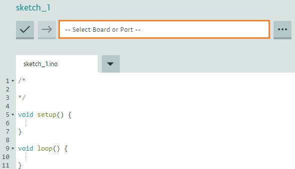

You can write and upload sketches on Chrome OS with the Web Editor in Arduino Cloud. The Web Editor has an extensive feature set similar to the desktop IDE. While many popular boards are compatible, you should check [the list of compatible boards here](https://support.arduino.cc/hc/en-us/articles/360014779899).

---

## Install the Chromebook app

To use Arduino boards on Chromebook, you need to install an app from Arduino which handles serial communication with the board.

### Arduino Cloud for Chromebook

The **Arduino Cloud for Chromebook** app is recommended for most popular and newer boards.

Follow these steps to install **Arduino Cloud for Chromebook**:

1. Open <a class="link-up-right" href="https://play.google.com/store/apps/details?id=cc.arduino.create_editor">Arduino Cloud for Chromebook (Google Play)</a>
2. Click the **Install** button on the page.
3. Choose the device and click **Install**.
4. Find the app in the **Launcher** to open it.
5. Sign into your Arduino account

The currently supported boards include:

* Arduino UNO R4 Minima
* Arduino UNO R4 WiFi
* Arduino UNO (R3 and older revisions)
* Arduino MKR WiFi 1010
* Arduino Nano 33 IoT
* Arduino RP2040 Connect
* Arduino UNO WiFi Rev2

### Arduino Create for Education

Follow these steps to install **Arduino Create for Education**:

1. Open <a class="link-up-right" href="https://chrome.google.com/webstore/detail/elmgohdonjdampbcgefphnlchgocpaij">Arduino Create for Education (Chrome web store)</a>
2. Click _Add to Chrome_.
3. Click _Add app_ to confirm.
4. Click _Launch app_ to start the Web Editor or go to [create.arduino.cc/editor](https://create.arduino.cc/editor).

<a class="link-chevron-right" href="https://support.arduino.cc/hc/en-us/articles/360014779899-Boards-compatible-with-the-Web-Editor">Learn more about boards compatible with the Web Editor</a>

---

## Use the Web Editor

1. Go to [create.arduino.cc/editor](https://create.arduino.cc/editor).
2. If you're not signed into an Arduino account, you will be asked to do so.
3. Connect a [compatible board](https://support.arduino.cc/hc/en-us/articles/360014779899#chromebook) to a USB port on your computer.
4. Select your board in the Boards Dropdown.

   

5. Start writing a new sketch in the editor, or use a sketch from the _Examples_ sidebar.

Learn more about the Web Editor:

* [Uploading a simple example](https://docs.arduino.cc/cloud/web-editor/tutorials/getting-started/getting-started-web-editor#uploading-a-simple-example)
* [Web Editor in Arduino Docs](https://docs.arduino.cc/cloud/web-editor)
