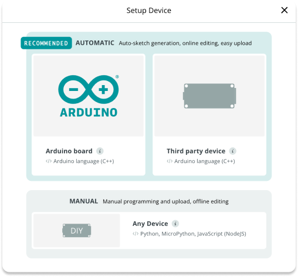
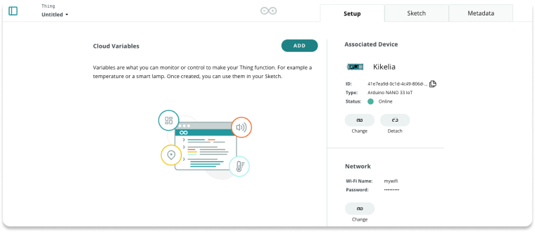

> Also see [Getting Started With the Arduino Cloud](https://docs.arduino.cc/cloud/iot-cloud/tutorials/iot-cloud-getting-started) in Arduino Docs.

Connecting a new device to Arduino Cloud consists of three steps:

1. [Add the device to Arduino Cloud](#add-the-device). Enables the device for use with Arduino Cloud.
2. [Configure the device as a Thing](#create-thing). This will generate a sketch that can be uploaded to the device, allowing it to connect to Arduino Cloud.
3. [Upload the sketch to the device](#upload-sketch). Upload the Thing sketch to the device.

You'll need an Arduino account and the [Arduino Create Agent](https://support.arduino.cc/hc/en-us/articles/360014869820) installed and running on your computer.

---

## Set-up instructions

### Step 1: Add the device

1. Go to Arduino Cloud and open the [Devices tab](https://app.arduino.cc/devices).

2. Click the **Add Device** button in the top-right or middle of the page.

   

3. Select your device type and set up a compatible Arduino board or third party device automatically. Alternatively, you can mannually setup your device. 

   > Hover over the <kbd>i</kbd> for a full list of compatible devices. 

    

4. **Proceed with the instructions to add your device.**

   > _Secrets:_ Secret keys cannot be recovered if lost. Make sure to save any Device ID and Secret key that's provided when adding an Arduino UNO R4 WiFi, Arduino Nano ESP32, or a 3rd party device (ESP32 and ESP8266).

   * _LoRaWAN®:_ Make sure you select the [right frequency band for your region](https://www.thethingsnetwork.org/docs/lorawan/frequencies-by-country/). When completing the setup, you'll receive a registration email for your <a class="link-external" href="https://www.thethingsnetwork.org/">The Things Stack Network Account</a>.

5. When finished, your new device will be added to your list of devices. Note that it will have an _offline_ status at this point.

   

### Step 2: Create and configure a Thing

1. Open the [Things tab](https://app.arduino.cc/things).

2. Click **Create Thing**.

   

3. Configure **Device** and **Network** for the new Thing:

   

   * Click the **Associated Device selection** button and select your device.

   * Click the **Network configure** button and enter the network credentials.

      * _Wi-Fi:_ Enter your Wi-Fi name (SSID) and password (encryption key).
      * _Arduino SIM:_ [Use these credentials](https://support.arduino.cc/hc/en-us/articles/360013825159-What-are-the-credentials-for-the-Arduino-SIM-card).
      * _Arduino with LoRa®:_ The credentials are added automatically.
      * _ESP32 and ESP8266:_ Enter the secret key that was provided when adding the device.

   

### Step 3: Upload the Thing sketch

1. With the Thing open, open the **Sketch** tab.

2. Click the **Upload button** and wait for the process to complete.

   

3. When the upload is finished, go back to the Thing setup tab.

4. After a short while, your device should come online. You may have to refresh the page.

   

   > **Note:** Device status is not supported by the LoRa protocol, see [About device status in Arduino Cloud](https://support.arduino.cc/hc/en-us/articles/4407169649682-About-device-status-in-IoT-Cloud).

---

## Troubleshooting

See [If your device can't be added or won't connect to Arduino Cloud](https://support.arduino.cc/hc/en-us/articles/360019355679-If-your-device-is-not-connecting-to-IoT-Cloud).
