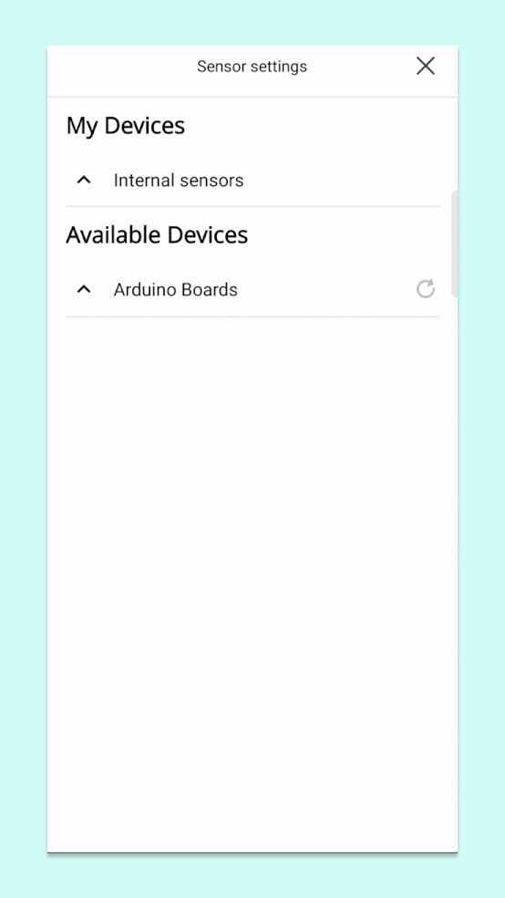
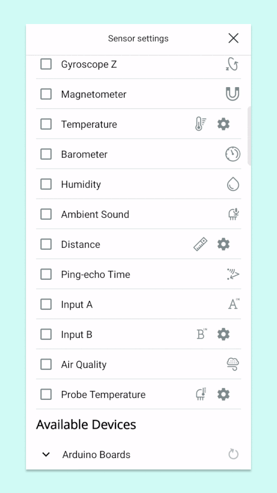

## Supported boards

The Science Journal app supports the following boards:

- Arduino Nano 33 BLE Sense
- Arduino MKR WiFi 1010 (with the Science carrier board)

## Set up your board

### Set up the Arduino MKR WiFi 1010

> The MKR WiFi 1010 can't be connected without the _Science carrier board_, which is only available in the [Arduino Science Kit Physics Lab](https://store.arduino.cc/products/arduino-science-kit-physics-lab).

The MKR WiFi 1010 included with the Science Kit comes with the required firmware out-of-the-box. [Follow these instructions](https://support.arduino.cc/hc/en-us/articles/4408029337746) if you are using an individually bought replacement or have flashed the board with different firmware.

1. Connect the board to the carrier, making sure that the pins (e.g. A1, A2) line up.

2. Power the setup, via a USB cable to the board or otherwise.

### Set up the Arduino Nano 33 BLE Sense

The Nano 33 BLE Sense needs to be flashed with special firmware for use with the Science Journal app.

1. [Flash the firmware](https://support.arduino.cc/hc/en-us/articles/4408029337746).

2. Power the setup, via a USB cable to the board or otherwise.

### Set up the Arduino Nano RP2040 Connect

The Nano RP2040 Connect needs to be flashed with special firmware for use with the Science Journal app.

1. [Flash the firmware](https://support.arduino.cc/hc/en-us/articles/4408029337746).

2. Power the setup, via a USB cable to the board or otherwise.

## Connect the Science Journal app

1. Open the Science Journal app.

2. Open or create a new experiment.

3. Tap the **Edit** button in the bottom-right.

4. Tap **Sensors**.

   

5. Open settings by tapping the cogwheel button in the top right.

   

6. Scroll down to **Available devices** and find the "Arduino Boards" category. Tap to to expand it (you may have to scroll down for the revealed items to show).

7. Tap your device name to connect.

## Troubleshooting

### Make sure you're expanding the Arduino Boards category

Under **Available Devices**, the arrow next to Arduino Boards should be pointing downwards (if not, tap it). You may have to swipe down to see the list.

### The board may already be added

If both the Internal sensors and the board sensor categories are expanded, they can be mistaken for a single category. Try swiping up, and tap to collapse the Internal sensors category. Your board may appear below.

