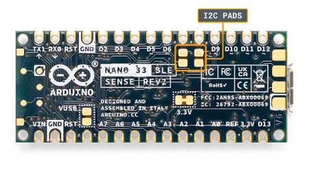

The Nano Family is a series of boards in the same form factor, with the same pin layout. This makes it easier for makers to design hardware accessories that can work with a wide range of Nano boards available.

While the pinout is near identical across the boards, there are some pins that differ, mainly to accomodate the functionalities of the MCU used on the board. In this article, we will explain the differences.

In this article:

* [Pinout differences](#pinout-differences)
* [Operating voltage differences](#operating-voltage-differences)
* [Other differences](#other-differences)

 ---

## Pinout differences

The table below presents an overview of the pinout differences:

<table>
  <tr>
    <th>Board</th>
    <th>Analog Header Reset</th>
    <th>AREF</th>
    <th>5V</th>
  </tr>
  <tr>
    <td>Nano</td>
    <td>RST</td>
    <td>AREF</td>
    <td>5V</td>
  </tr>
  <tr>
    <td>Nano Every</td>
    <td>RST</td>
    <td>AREF</td>
    <td>5V</td>
  </tr>
  <tr>
    <td>Nano 33 BLE</td>
    <td>RST</td>
    <td>AREF</td>
    <td>VUSB</td>
  </tr>
  <tr>
    <td>Nano 33 BLE Sense</td>
    <td>RST</td>
    <td>AREF</td>
    <td>VUSB</td>
  </tr>
  <tr>
    <td>Nano 33 BLE Sense Rev2</td>
    <td>RST</td>
    <td>AREF</td>
    <td>VUSB</td>
  </tr>
  <tr>
    <td>Nano 33 IoT</td>
    <td>RST</td>
    <td>AREF</td>
    <td>VUSB</td>
  </tr>
  <tr>
    <td>Nano RP2040 Connect</td>
    <td>REC</td>
    <td>AREF</td>
    <td>VUSB</td>
  </tr>
  <tr>
    <td>Nano ESP32</td>
    <td>B1 (Boot 1)</td>
    <td>B0 (Boot 0)</td>
    <td>VBUS</td>
  </tr>
</table>

This pinout differences are relevant for users who intend to design their own hardware or purchase a 3rd party accessory for the Nano form factor. For example, using an accessory designed for a specific Nano version, (e.g. Nano Every), with a Nano ESP32 may cause issues depending on how the hardware is implemented. In this case, the RST pin in the Nano Every is located where the B1 (`BOOT1`) pin is on the Nano ESP32, which can create problems when powering up the board.

---

## Operating voltage differences

The boards in the Nano Family operate at different voltages:

**Boards that operate on 5 V:**

* Arduino Nano
* Arduino Nano Every

**Boards that operate on 3.3 V:**

* Arduino Nano 33 BLE
* Arduino Nano 33 BLE Sense
* Arduino Nano 33 BLE Sense Rev2
* Arduino Nano 33 IoT
* Arduino Nano RP2040 Connect
* Arduino Nano ESP32

---

## Other differences

Besides the pinout layout, there are other visual differences in the Nano Family boards.

### VUSB pads

It is possible to [enable 5 V power on the VUSB or VBUS pin on Nano boards](https://support.arduino.cc/hc/en-us/articles/360014779679-Enable-5-V-power-on-the-VUSB-or-VBUS-pin-on-Nano-boards) that operate on 3.3V. On all of these boards (except the Nano ESP32), two VUSB pads must be shorted in order to enable the VUSB pin. On the Nano ESP 32, The VBUS pin is enabled by default and these two pads are not present.

<table>
  <tr>
    <td></td>
    <td></td>
  </tr>
</table>

### I2C pads

The Nano 33 BLE, the Nano 33 BLE Sense, and Nano 33 BLE Sense Rev2 have two unnamed pads on the back:

These exposed pads can be used for installing pull-up resistors when using the I2C protocol. <a class="link-chevron-right" href="https://support.arduino.cc/hc/en-us/articles/11153357842588-I2C-and-pull-up-resistors">Read more about I2C and pull-up resistors</a>
