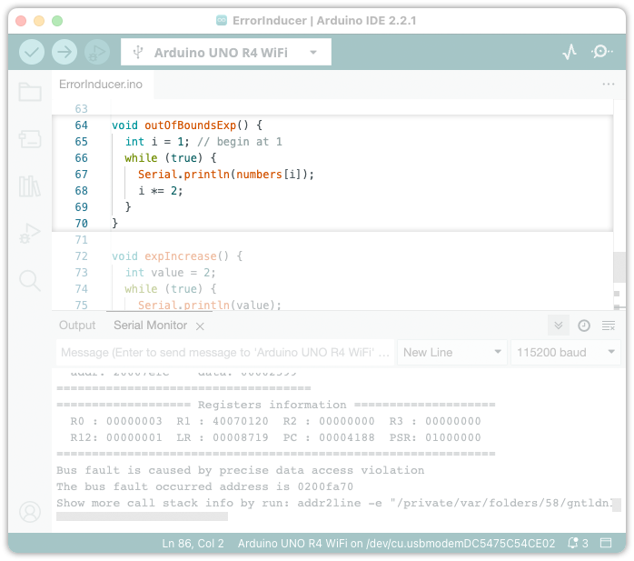

The UNO R4 WiFi uses [CmBacktrace](https://github.com/armink/CmBacktrace) to print useful information in the serial output when a runtime error occurs. The output includes an `addr2line` command that can be used to find the line in your sketch where the runtime error occurred.

---

## Getting the output

Follow these steps:

1. Ensure that a serial connection must be initiated before the error occurs, by calling [Serial.begin()](https://www.arduino.cc/reference/en/language/functions/communication/serial/begin/) in your sketch. You can include this code inside the beginning of the `setup()` function:

   ```
   Serial.begin(115200);
   while (!Serial);
   ```

2. Connect your UNO R4 WiFi board to your computer.
3. Open the Serial Monitor. Click the  **Serial Monitor** button in the top-right corner or select  **Tools > Serial Monitor** in the menu bar.
4. If you made any changes to your sketch, click the  **Upload** button. Otherwise, you can simply press the **RESET** button on the board.
5. If an exception occurs on the board, information will be output in the Serial Monitor.
6. Following the "Registers information" table, the type of fault will be specified. You can read more about the types [here](https://wiki.segger.com/Cortex-M_Fault#Cortex-M_Fault_Exceptions).
7. The last line includes a command for the `addr2line` utility. See [Running addr2line for more information](#running-addr2line).


---

<a id="running-addr2line"></a>

## Running addr2line for more information

The `addr2line` utility is included in the **Arduino UNO R4 Boards** boards package. However, running it in this way requires modifying the command included in the output. For convenience, you may want to install `addr2line` on your system.

Install `addr2line` (optional):

* **Windows:** `addr2line` is not available as a native Windows application, but can be run with [Windows Subsystem for Linux](https://learn.microsoft.com/en-us/windows/wsl/install). The Ubuntu distribution of Linux is installed by default and should come with `addr2line`. Otherwise, install it with `apt-get install binutils`.
* **macOS:** `addr2line` can be installed with [Homebrew](https://brew.sh/) by running `brew install binutils` in Terminal.
* **Linux:** `addr2line` may already be installed on your system. Otherwise, run `apt-get install binutils` in Terminal (Ubuntu, Debian), or see [command-not-found.com/addr2line](https://command-not-found.com/addr2line) for other distributions.

### 1. Copy the addr2line command (and modify it if necessary)

**If addr2line is installed on your system:**

* **Windows:**
  1. Copy the command from the serial output.
  2. Paste the command into a text editor.
  3. Replace `C:` with `/mnt/c` and replace all* backslashes (`\`) with forward slashes (`/`).
* **macOS:** Copy the command from the serial output (no modification required).
* **Linux:** Copy the command from the serial output (no modification required).

**Using the addr2line from the board package:**

* **Windows:**
  1. Copy the command from the serial output.
  2. Paste the command into a text editor.
  3. Replace the word `addr2line` with `/mnt/c/Users/User/Appdata/Local/Arduino15/packages/arduino/tools/arm-none-eabi-gcc/7-2017q4/bin/arm-none-eabi-addr2line`
  4. For the filepath after the `-e` flag, replace `C:` with `/mnt/c` and replace **all** backslashes (`\`) with forward slashes (`/`).

* **macOS:**
  1. Copy the command from the serial output.
  2. Paste the command into a text editor.
  3. Replace the word `addr2line` with `~/Library/Arduino15/packages/arduino/tools/arm-none-eabi-gcc/7-2017q4/bin/arm-none-eabi-addr2line`.
* **Linux:**
  1. Copy the command from the serial output.
  2. Paste the command into a text editor.
  3. Replace the word `addr2line` with `.arduino15/packages/arduino/tools/arm-none-eabi-gcc/7-2017q4/bin/arm-none-eabi-addr2line`.

### 2. Running the addr2line command

> **Note:** The sketch needs to have been compiled on the same computer you are running `addr2line` on.

* **Windows:** `addr2line` is not available as a native Windows application, but can be run with [Windows Subsystem for Linux](https://learn.microsoft.com/en-us/windows/wsl/install). The Ubuntu distribution of Linux is installed by default and should come with `addr2line`. Otherwise, install it with `apt-get install binutils`.
  1. Open [Windows Powershell](https://learn.microsoft.com/en-us/powershell/scripting/windows-powershell/starting-windows-powershell?view=powershell-7.3).
  2. Type `Ubuntu` into Windows Powershell and press <kbd>Enter</kbd>.
  3. Paste the modified command into Windows Powershell by right-clicking on the window.
  4. Press <kbd>Enter</kbd> to run the command.
* **macOS:**
  1. Open Terminal.
  2. Press <kbd>⌘</kbd> + <kbd>V</kbd> to paste the command.
  3. Press <kbd>Enter</kbd> to run the command.
* **Linux:**
  1. Open Terminal.
  2. Press <kbd>Ctrl</kbd> + <kbd>⇧Shift</kbd> + <kbd>V</kbd> to paste the command.
  3. Press <kbd>Enter</kbd> to run the command.

### 3. Reading the addr2line output

1. Look for the first line that includes the path to your sketch. The line number where the error occurred follows immediately after. For example, `/Users/username/Documents/Arduino/ErrorInducer/ErrorInducer.ino:67` indicates that the error occurred on line 67.
2. Find the line in Arduino IDE. Line numbers are printed to the left of each line of code. Analyze the row where the error occurred.

   In this example, an out-of-bounds access of the `numbers` array occurs after a few iterations of the `while(true)` loop:

   

3. If it's not clear from where in the sketch `outOfBoundsExp()` was called, we can look at the backtrace again.