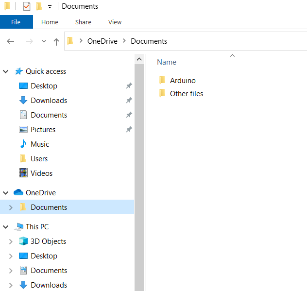

The [Microsoft OneDrive Files On-Demand](https://support.microsoft.com/en-au/office/save-disk-space-with-onedrive-files-on-demand-for-windows-0e6860d3-d9f3-4971-b321-7092438fb38e) feature allows access to cloud storage files in OneDrive from the File Explorer without downloading them. Since this feature requires an internet connection to synchronize files, it can lead to essential files not being available, creating issues when starting Arduino IDE on Windows (e.g. the initialization window appears and disappears without showing any error message or warning), or errors during compilation (e.g. `The cloud file provider is not running`). Learn more about possible solutions.

---

## Disable Files On-Demand for Arduino files

The [sketchbook is located](https://support.arduino.cc/hc/en-us/articles/4412950938514-Open-the-Sketchbook) inside the "Documents" folder by default. Using OneDrive to back up your "Documents" folder with "Files On-Demand" active can lead to sketch or library files not being available when compiling, resulting in the `The cloud file provider is not running` error. To keep OneDrive backup active but disable "Files On-Demand" for the desired files:

1. Go to the File Explorer and navigate to the "OneDrive" folder containing your sketchbook (e.g. `OneDrive\Documents\Arduino`).

   

2. Right-click the folder and select **Always keep on this device**.

   

## Move Arduino IDE files to a non-OneDrive folder

You can also move Arduino IDE files to a folder not synced with OneDrive (note that the files will not be backed up).

### Sketchbook

   1. Open Arduino IDE.
   2. Go to **File > Preferences**.
   3. Change the sketchbook location to a folder not synced with OneDrive.
         * For example: `C:\Users\{username}\Arduino`
         * Avoid paths like: `C:\Users\{username}\OneDrive\Documents\Arduino\...`

### Application files

   1. [Uninstall Arduino IDE](https://support.arduino.cc/hc/en-us/articles/360021325733-Uninstall-Arduino-IDE) from your computer.
   2. [Install Arduino IDE](https://support.arduino.cc/hc/en-us/articles/360019833020-Download-and-install-Arduino-IDE) outside the OneDrive folder.
      * For example: `C:\Program Files\Arduino IDE` or `C:\Users\{username}\AppData\Local\Programs\Arduino IDE`
      * Avoid paths like: `C:\Users\{username}\OneDrive\Documents\Arduino\...`

If you are using an Arduino IDE [portable installation](https://docs.arduino.cc/software/ide-v1/tutorials/PortableIDE), move the folder to a location outside the OneDrive folder.

## Disabling OneDrive back up

If you don't want to use OneDrive to back up a specific folder, you can disable it by following the next steps:

1. Make sure that your internet connection is stable.
2. Open Microsoft OneDrive (look for the OneDrive icon inside the system tray at the bottom-right of the taskbar):

   

3. Click on the settings icon and go to "Settings":

   

4. Go to "Sync and back up" and click on "Manage back up":

   

5. Disable the back up option for the folder containing Arduino IDE and click "Save changes":

   
